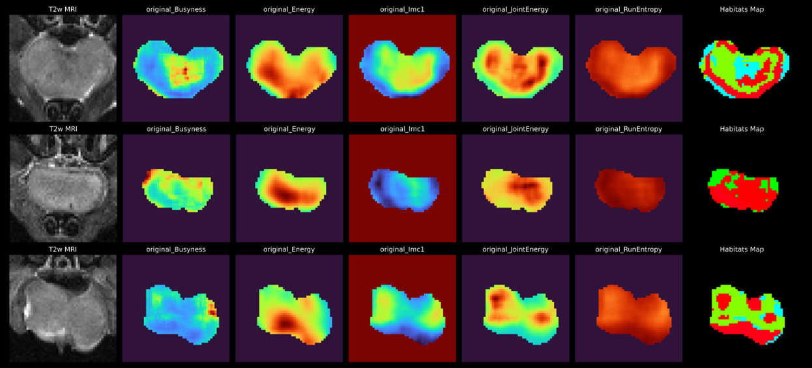

# rocqiomics



**A Deep Learning-Inspired Radiomics Framework Tailored To Habitat Imaging.**

**`rocqiomics`** provides a Monai-inspired interface to IBSI-compliant radiomics engines, and features tooling designed with voxel-wise "habitat radiomics" workflows in mind.

Habitat Radiomics extracts voxel-wise feature maps to cluster voxels into several 'habitats' that contain distinct textures. [1]

## Key Features

- Radiomics pipeline with modern, deep-learning–inspired **data dictionary API**
- Classes for **Habitat Radiomics** - voxel-wise clustering based on multi-channel feature maps 
- Native support for **Monai dictionary transforms** for preprocessing and augmentation [2]
- Uses validated radiomics engine **PyRadiomics** [3] or its PyTorch-based, GPU-native equivalent **fastrad** [4]
- Provides seamless portability of existing Pyradiomics workflows with a user-friendly interface
---

## Core Components

The library has three main classes.

### 🔹 `Rocqiomics` | Primary Feature Extraction Interface

- Handles image **loading, preprocessing, and augmentation** with `monai.Transforms`
- Supports both standard **numerical features** and **voxel-wise feature maps**
- Performs input validation and robust extraction
- Handles flexible results saving and metadata handling
- Provides **seamless portability** of existing Pyradiomics workflows with a user-friendly interface


#### Usage

```
import rocqiomics as rq
from rocqiomics.transforms import N4ITKBiasFieldCorrection

from monai.transforms import (
    Compose,
    NormalizeIntensityd,
    Spacingd,
    Rotated
)

### Define data dicts with your case data (case_id and metadata optional) ###
data_dicts = [
    {
        'case_id' : 'id_1',
        'image' : '../path/to/image_1',
        'mask' : '../path/to/mask_1',
        'metadata' : {
            'modality' : 'CT'
        }
    },
    {
        'case_id' : 'id_2',
        'image' : '../path/to/image_2',
        'mask' : '../path/to/mask_2',
        'metadata' : {
            'modality' : 'CT'
        }
    },
]

### Define extractor object with engine and Monai.transform preprocessing and augmentation ###
extractor = rq.Rocqiomics(
    preprocessing=Compose([
        N4ITKBiasFieldCorrection(image_key='image', mask_key='mask', max_iterations=20),
        NormalizeIntensityd(keys=['image']),
        Spacingd(keys=['image', 'mask'], pixdim=(1.0, 1.0, 1.0), mode=[3, 'nearest']),
    ]),
    augmentations=[
        Rotated(keys=['image', 'mask'], angle=0.1, mode=['bilinear', 'nearest']),
    ],
    filter_types=['Original'],
    bin_width=10.0,
    voxel_based=False,
    engine='fastrad'
)

"""
Run on all data dicts. Output is:
 - Pandas DataFrame of features (voxel_based=False)
 - Dictionary of feature map SimpleITK images (voxel_based=True)
"""
results = extractor.run_pipeline(data_dicts)

"""
Otherwise, for memory efficiency (especially with feature maps),
run the generator-based pipeline to generate results dynamically.
"""
results_generator = self.map_extractor.run_generator(data_dicts)
for res_dict in results_generator:
    # do something with result_dict

```


Want to reproduce a Pyradiomics workflow? Just pass the settings YAML file as a parameter!

```
extractor = rq.Rocqiomics(
    extraction_settings_yaml_filepath='../path/to/settings.yaml',
    engine='pyradiomics'
)
results = extractor.run_pipeline(data_dicts)
```

Want to implement a perturbation-based worflow a la Zwanenburg et al. [5]? Use augmentations!

```
import numpy as np

from monai.transforms import (
    RandGaussianNoised,
    RandAffined
)

NUM_PERTURBATIONS = 10

random_perturbation = Compose([
    RandGaussianNoised(keys=['image'], prob=1, mean=0, std=500, sample_std=True),
    RandAffined(
        keys=['image', 'mask'], mode=[3, 'nearest'], prob=1.0,
        rotate_range=(0.0, 0.0, np.deg2rad(5.0)), translate_range=(1.0, 1.0, 0.0)
    ),
])

extractor = rq.Rocqiomics(
    preprocessing=Compose([
        N4ITKBiasFieldCorrection(image_key='image', mask_key='mask', max_iterations=20),
        NormalizeIntensityd(keys=['image']),
        Spacingd(keys=['image', 'mask'], pixdim=(1.0, 1.0, 1.0), mode=[3, 'nearest']),
    ]),
    augmentations=[random_perturbation for i in range(NUM_PERTURBATIONS)],
    filter_types=['Original'],
    bin_width=10.0,
    voxel_based=False,
    engine='fastrad'
)
results = extractor.run_pipeline(data_dicts)
```

### 🔹 `RadiomicsHabitatGenerator` | **End-to-End Habitat Radiomics Pipeline**

- Automated feature map extraction + voxel-wise clustering
- Generates maps dynamically for memory efficiency
- Augmentation-aware pipeline
- Supports any clustering algorithm implemented for HabitatGenerator

Combines:

- `Rocqiomics` → voxel-wise feature extraction  
- `HabitatGenerator` → voxel clustering  

#### Usage

```
import rocqiomics as rq
from rocqiomics.transforms import N4ITKBiasFieldCorrection

from monai.transforms import (
    Compose,
    NormalizeIntensityd,
    Spacingd,
    Rotated
)

### Define data dicts same as for rq.Rocqiomics feature extraction ###
data_dicts = [
    {
        'case_id' : 'id_1',
        'image' : '../path/to/image_1',
        'mask' : '../path/to/mask_1',
        'metadata' : {
            'modality' : 'CT'
        }
    },
    {
        'case_id' : 'id_2',
        'image' : '../path/to/image_2',
        'mask' : '../path/to/mask_2',
        'metadata' : {
            'modality' : 'CT'
        }
    },
]

### Define generator which automatically extracts maps and fits or predicts habitat clusters ####
radhab = rq.RadiomicsHabitatGenerator(
    preprocessing=Compose([
        N4ITKBiasFieldCorrection(image_key='image', mask_key='mask', max_iterations=20),
        NormalizeIntensityd(keys=['image']),
        Spacingd(keys=['image', 'mask'], pixdim=(1.0, 1.0, 1.0), mode=[3, 'nearest']),
    ]),
    augmentations=[
        Rotated(keys=['image', 'mask'], angle=0.1, mode=['bilinear', 'nearest']),
    ],
    bin_width=10.0,
    features=['Mean', 'Autocorrelation', 'Entropy],
    filter_types=['Original'],
    algorithm='kmeans',
    n_clusters=4,
    batch_size=25,
    save_vector_dirpath='../path/for/temporary/4d_vectors_storage/before/clustering', # required
)

"""
Fit the habitat generator using data and return the predicted habitats
Output is a list of numpy arrays (or, optionally, sitk images) containing habitat predictions
"""
predictions, result_ddicts = radhab.fit_predict(data_dicts)
```


---

### 🔹 `HabitatGenerator` | **Voxel Clustering Engine for Multi-Channel Imaging**

Clusters voxels based on 4D feature vectors across channels, which could be:

- Radiomics feature maps  
- Multiparametric MRI images 
- Any multi-channel volumetric data  

#### Supported algorithms
- MiniBatch KMeans
- Gaussian Mixture Models (GMM)
- Birch 
- Fuzzy C Means


#### Usage

```
import rocqiomics as rq
import SimpleITK as sitk

# Load channel images
adc_img = sitk.ReadImage('../path/to/ADCmap.nrrd')
t1map_img = sitk.ReadImage('../path/to/T1map.nrrd')
mask_img = sitk.ReadImage('../path/to/mask.seg.nrrd') # Optional

# Stack channels into a single one vector image
vector_img = sitk.Compose([adc_img, t1map_img])

# Wrap vector image in our data_dict format
data_dicts = [
    {
        'image' : vector_img,
        'mask : mask_img # optional
    }
]

### Define habitat generator with channel names and number of clusters to fit
habitat_generator = HabitatGenerator(
    channels=["ADC", "T1map"],
    n_clusters=4,
    algorithm='gmm'
)

"""
Fit the habitat generator using data and return the predicted habitats
Output is a list of numpy arrays (or, optionally, sitk images) containing habitat predictions
"""
predictions = gmm.fit_predict(data=data_dicts, return_as_sitk_image=False)

```


## Installation

```bash
git clone https://github.com/iamrjgs/rocqiomics.git
cd rocqiomics
pip install -e .
```

## Acknowledgements

Development of `rocqiomics` was supported by grants from the the US National Cancer Institute 1R01CA243456-01A1 and the Roswell Park Alliance Foundation.

## References

[1] Prior O, Macarro C, Navarro V, Monreal C, Ligero M, Garcia-Ruiz A, Serna G, Simonetti S, Braña I, Vieito M, Escobar M, Capdevila J, Byrne AT, Dienstmann R, Toledo R, Nuciforo P, Garralda E, Grussu F, Bernatowicz K, Perez-Lopez R. Identification of precise 3D CT radiomics for habitat computation by machine learning in cancer. Radiology: Artificial Intelligence. 2024;6(2):e230118. https://doi.org/10.1148/ryai.230118

[2] The MONAI Consortium. (2020). Project MONAI. Zenodo. https://doi.org/10.5281/zenodo.4323059

[3] van Griethuysen, J. J. M., Fedorov, A., Parmar, C., Hosny, A., Aucoin, N., Narayan, V., Beets-Tan, R. G. H., Fillion-Robin, J. C., Pieper, S., Aerts, H. J. W. L. (2017). Computational Radiomics System to Decode the Radiographic Phenotype. Cancer Research, 77(21), e104–e107. https://doi.org/10.1158/0008-5472.CAN-17-0339 | https://github.com/AIM-Harvard/pyradiomics/tree/master

[4] Sánchez-Femat, Erika and Celaya-Padilla, José-María and Galvan-Tejada, Carlos Eric, fastrad: Complete, IBSI-Validated GPU Acceleration of the Full PyRadiomics Feature Set. Available at SSRN: https://ssrn.com/abstract=6436486 or http://dx.doi.org/10.2139/ssrn.6436486 | https://github.com/helloerikaaa/fastrad

[5] Zwanenburg, A., Leger, S., Agolli, L. et al. Assessing robustness of radiomic features by image perturbation. Sci Rep 9, 614 (2019). https://doi.org/10.1038/s41598-018-36938-4

